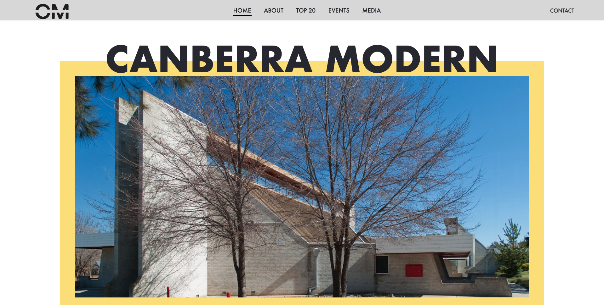

# 11056 - CANBERRA MODERN WEBBSITE

## REFLECTION:
The 'Canberra Modern' Website is built to showcase Canberra’s unique mid – late twentieth century places and spaces. 

The goal of the website is to draw inspiration from, and reflect the personality of, Canberra as a modernist city. To achieve this, I took full advantage of CM colours for the website content and pages and experimented with different div shapes.

Having learned about HTML and CSS before this unit, creating the structure for the website was not the challenging part. Designing the layout that fulfill the needs of CM made me struggle.

Overall, the finished website is similar to the low-fi layout prototype with small changes to fit the size of the content. 

Although I have successfully built the website I envisioned in the concept developing stage, I find that the website still has room to grow in terms of layout and visuals to reflect the fun and playful style of the program. 

If I could redo this project, I would invest more in the concept ideation, experiment with different compositions and think outside the box.

